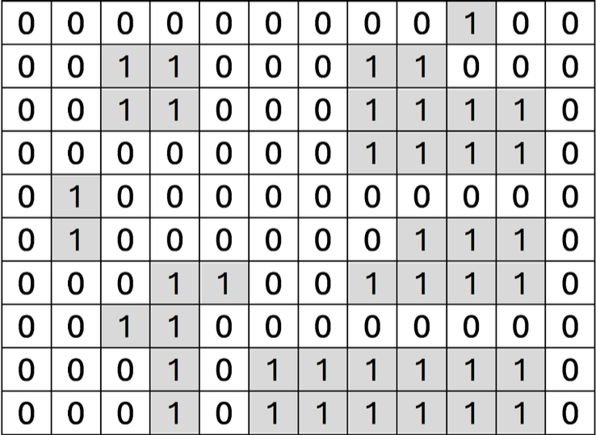

# 🌴 Island-Trip - Island Detection & Graph Exploration

This project takes a grid of land (1) and water (0)

This program finds all the distinct islands (connected groups of 1s), figures out how big they are, and then tries to find the shortest bridge from the smallest island to the biggest one.

Every island is connected to:

* The smallest island larger than itself

* The largest island smaller than itself

* Any island with the same digit sum (size-wise)

If their sizes have the same sum-of-digits, there is a bridge between them.

This project demonstrates my understanding of;
1. Graph traversal algorithms (BFS, DFS)
2. File I/O handling in Java
3. Debugging and error handling
4. 2D Array and Matrix Manipulation
5. Data Structures (HashMaps, TreeSets, and List Operations)
6. Command Line Args
7. Error Handling & Debugging


### What this Program Does
1. Measures each Island and outputs the size in sorted order
2. Minimum number of bridges that must be crossed to get from the smallest to largest island


### How it works
1. Uses Depth First Search Algorithm to label islands and calculates their sizes
2. Stores the island sizes in a list
3. Use Breadth First Search to find the minimum bridges ti cross from the smallest to the largest

### How to compile and run
``` javac IslandTrip.java```

``` java IslandTrip [IslandFile].txt ```

(where [filename].txt is your input file, like example.txt)

### Example

Input example:



example.txt
```
000000000100
001100011000
001100011110
000000011110
010000000000
010000001110
000110011110
001100000000
000101111110
000101111110
```

``` java IslandTrip example.txt

2
4
6
7
11
12
Shortest Path Length: 2
Execution time: 0.007538541

```

2, 4, 6, 7, 11, 12 are the sizes of the islands in sorted order

Shortest Path Length: 2 is the number of bridges to cross from island of size 2 to size 12